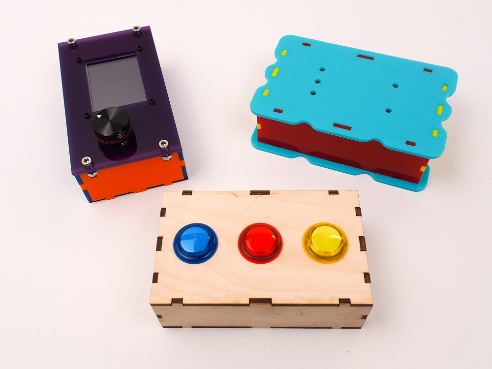

## Three methods

There are a number of ways to design and construct a laser-cut enclosure. Many of these methods are adaptations of traditional joinery techniques used in woodworking or other types of flat stock fabrication. With certain adaptations, these techniques work well as laser cut designs, and can be made more quickly and easily than their wood shop counterparts, which require many repetitions of highly accurate cuts.

The high precision and minimal kerf (the gap of material lost along a cut) of laser cutting means that you can build joints and features to accommodate your components with very tight tolerances. You can design your enclosure using free, open-source vector drawing tools such as [Inkscape](https://inkscape.org/en/){:target="_blank"}. There are also web browser–based box generators such as [makercase.com](http://makercase.com){:target="_blank"} to get you started.

Including components is easy. Add a proper circle to your design and you’ve got a perfect, press-fit opening for an arcade button!

