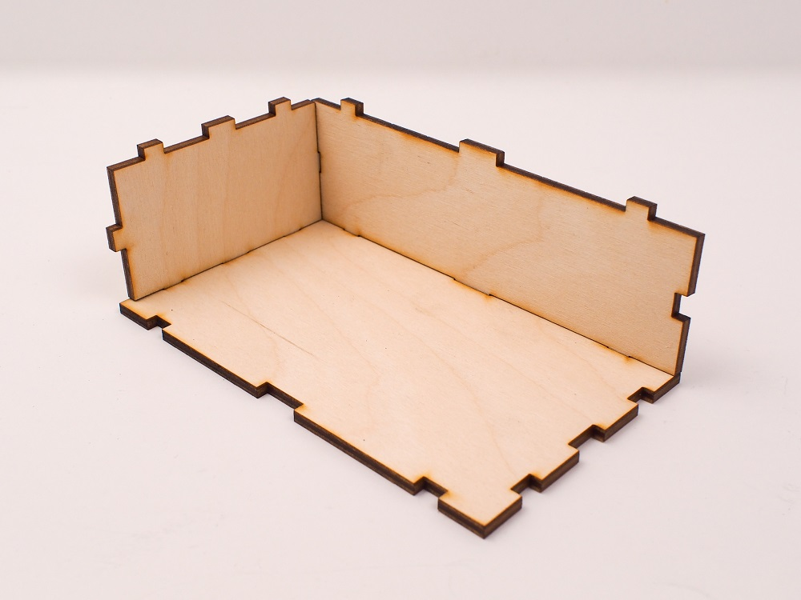

## Finger joints
The finger joint (a.k.a. box joint) is possibly the most popular technique in laser cut joinery. It is perfect for joining two pieces at 90 degree angles, is strong, and creates clean, flush joints. 

The key to making finger joints is creating interlocking tabs with a cut depth equal to the thickness of the material stock you are joining. This is because the pieces you’ll join will be at right angles, so the tab of part A will fit into the gap in part B without falling short or protruding beyond the face of part B. 

After cut and assembly, finger joints are typically glued together with an appropriate adhesive for your material type, such as wood glue for wood, or acrylic cement for acrylic. 

Note, you can place the tabs wherever you like on the edges, so long as you match them to the gaps of the joining face. It’s not uncommon to see finger joints run across the entire length of each edge, which is what the parametric online software usually does, but that’s not usually necessary — you can get away with far fewer tabs, which makes for a quicker cut on the laser. 

