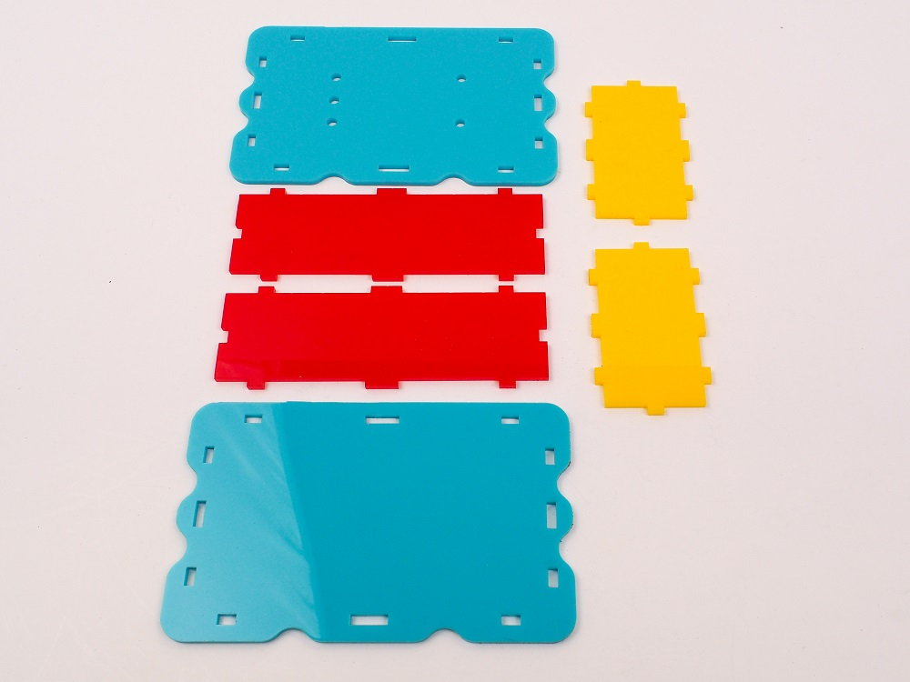

## Mortise & tenon joints
Another popular technique is the mortise and tenon, which is the woodworking name for a fitted slot and peg joint These are great when you want overhanging faces for some parts, such as a rounded lid that sits on top of the side walls. This face will have no tabs, only mortises that fit over tenons protruding from the side walls. By limiting your tenon height to the material depth, you’ll create joints flush to the surface. 

