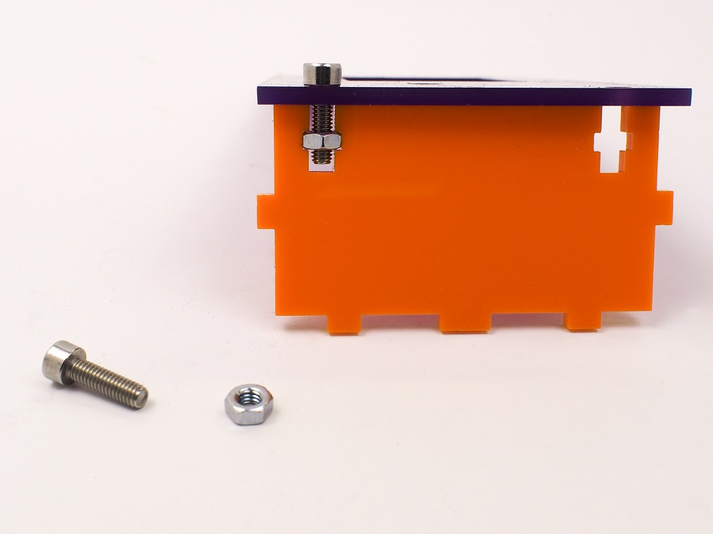

## Captive nut and screw T-slot joints

Finger joints and mortise and tenon joints are usually glued together. If you need to open and close your case, consider using screws and nuts with the clever t-slot design. You’ll be able to join panels at right angles as before, but this time by holding a square nut (a hex will do, just not quite as neatly) in one panel, and sending a screw through from the face of the second. No glue required!  Don’t forget, you can mix these methods as needed, such as creating an enclosure with five box jointed/glued sides, plus a t-slotted back panel for easy removal using screws and nuts.  By designing your enclosure to fit your parts, you can make the exact fit and spacing you need. Use data sheets, dimensional drawing, and a set of digital callipers to fit things such as cut-outs for buttons and jacks, mounting holes for parts, and windows and bezels for displays.  There are, as you may imagine, many other ways to join together laser cut parts, but these fundamental methods will serve you well, and get you building great enclosures quickly.

